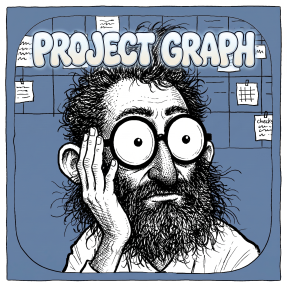

<p align="center">
  
</p>

<h1 align="center">Project Graph</h1>

`project-graph` is a local, provenance-first engineering knowledge graph for
source repositories. Reviewed JSONL assertions are the portable source of
truth; SQLite is a generated query index that can always be rebuilt.

It is language-, framework-, graph-database-, model-provider-, and
agent-framework independent. The executable is a single Rust binary and uses
SQLite compiled into the binary.

## Why use it?

Source search tells you where a symbol appears. Project Graph records reviewed
engineering relationships that are otherwise easy to lose:

- which invariants guard a subsystem;
- what must change together;
- why a decision was made;
- which incident exposed a coupling;
- which tests verify a claim;
- and the exact source span supporting every relationship.

A neighborhood query returns compact, reviewed facts:

```bash
project-graph --project . --json neighbors protocol:serve --depth 1
```

```json
{
  "center": {"id": "protocol:serve", "type": "Interface", "name": "Serve message"},
  "nodes": [
    {"id": "symbol:sendServe", "type": "Symbol", "name": "sendServe"},
    {"id": "invariant:server-authoritative-serve", "type": "Invariant",
     "name": "Serves are granted only by the server"},
    {"id": "test:serve-round-trip", "type": "Verification", "name": "serve round trip"}
  ],
  "edges": [
    {"source_id": "symbol:sendServe", "predicate": "SENDS", "target_id": "protocol:serve"},
    {"source_id": "protocol:serve", "predicate": "GUARDED_BY",
     "target_id": "invariant:server-authoritative-serve"},
    {"source_id": "protocol:serve", "predicate": "VERIFIED_BY",
     "target_id": "test:serve-round-trip"}
  ]
}
```

(Trimmed; real rows also carry descriptions, review state, and confidence.)

That output drops straight into an LLM prompt as trusted context:

```text
Reviewed project knowledge for this task:
<paste the JSON above>

We want clients to retry serve requests when the connection drops.
What must not break, and which test should catch a regression?
```

The model can now answer from recorded relationships — the retry must respect
the server-authoritative invariant, and `test:serve-round-trip` is the
regression gate — instead of inferring couplings from a source search. Follow
with `evidence protocol:serve` when the answer should quote the exact source
spans.

Evidence uses stable source-text anchors rather than line numbers. Moving an
unchanged block does not invalidate it; changing or removing the block does.

## Install

Install from source with Rust 1.83 or newer:

```bash
cargo install --path .
```

Or build a local release binary:

```bash
cargo build --release
```

The binary is `target/release/project-graph` (or
`target\release\project-graph.exe` on Windows).

## Quick start

```bash
project-graph --project /path/to/repo init --name example
project-graph --project /path/to/repo --json status
project-graph --project /path/to/repo validate
project-graph --project /path/to/repo lock
project-graph --project /path/to/repo build
project-graph --project /path/to/repo query websocket
project-graph --project /path/to/repo neighbors component:server --depth 2
project-graph --project /path/to/repo eval
project-graph --project /path/to/repo verify --require-fresh --require-same-commit
```

Project-owned data lives in the target repository:

```text
.project-graph/
  config.json
  assertions/*.jsonl
  evidence-lock.json
  gold-questions.json
  cache/graph.sqlite       # generated and ignored
```

The Rust port consumes the same project data as the original Python
implementation. No migration is required.

## Assertion format

Each non-comment line in an assertion file is one JSON object:

```json
{"kind":"node","id":"protocol:serve","type":"Interface","name":"Serve message","description":"Requests an authoritative serve."}
{"kind":"edge","id":"edge:client-sends-serve","source":"symbol:sendServe","predicate":"SENDS","target":"protocol:serve","evidence":[{"path":"src/client.js","start_anchor":"function sendServe(","end_anchor":"socket.send(message);","method":"deterministic","review":"reviewed"}]}
{"kind":"alias","alias":"OP_SERVE","node":"protocol:serve"}
```

An anchor must be unique unless an explicit `start_occurrence` or
`end_occurrence` is supplied. Occurrences are 1-based: `start_occurrence`
counts matching lines from the top of the file, and `end_occurrence` counts
from the start line onward (inclusive), so the pair always selects a forward
span.

## The evidence lock

`.project-graph/evidence-lock.json` records which evidence spans a human has
accepted. `lock` resolves every anchor against the current source, hashes each
resolved span, and stores the hashes. It refuses candidate records, and the
file is replaced atomically: unlike the SQLite cache, the lock cannot be
regenerated from anything else.

Afterwards, `stale`, `status`, `build`, and `verify` re-resolve each anchor
and compare hashes. Every citation is in one of four states:

- `fresh` — the span resolves and its content is unchanged. Moving an
  unchanged block keeps it fresh; anchors follow the text, not line numbers.
- `stale` — the anchor resolves but the span's content changed. The claim it
  supports needs re-review.
- `unresolved` — the anchor no longer matches, or matches ambiguously.
- `unlocked` — the citation was never accepted.

No command requires a lock. `build` and the query commands work on an
unlocked graph; citations simply report `unlocked`, which means drift cannot
be told apart from never-reviewed. Locking is what gives `stale` and `verify`
meaning:

1. Edit assertions, then `validate`.
2. `lock` to accept the current spans.
3. Work on the code. `stale` lists the claims whose supporting spans changed;
   re-review those assertions, then `lock` again.
4. For checkpoints, `verify --require-fresh` exits nonzero when accepted
   evidence has drifted.

When available, `lock` also captures the Git commit, tree, branch, and
worktree cleanliness. This is handoff provenance, not a freshness rule: an
unrelated commit does not make unchanged evidence stale. `lock
--require-clean-worktree` and `verify --require-same-commit
--require-clean-worktree` check that context only at explicit checkpoints.

Lock after work settles rather than mid-refactor; locking churning code
accepts spans that are about to change again.

## Commands

| Command | Purpose |
| --- | --- |
| `init` | Create a reusable starter configuration. |
| `validate` | Validate records, references, policies, paths, and anchors. |
| `lock` | Explicitly accept current evidence-span hashes. |
| `build` | Reuse an unchanged generated index or atomically replace it when reviewed inputs change. |
| `query` | Full-text search reviewed node IDs, names, descriptions, aliases, and edges. Words are plain terms; FTS operators are not interpreted. |
| `neighbors` | Traverse a typed neighborhood. |
| `path` | Find a shortest graph path. |
| `impact` | Traverse only configured impact predicates. |
| `evidence` | Display the exact source spans for a node or edge. |
| `stale` | Report unlocked, changed, or unresolved evidence. |
| `status` | Report index availability, evidence freshness, and Git lock context without requiring an index. |
| `verify` | Report or optionally enforce evidence and Git lock requirements. |
| `diagnostics` | Report graph counts, candidates, staleness, and hubs. |
| `eval` | Run deterministic graph-retrieval checks. |
| `export` | Produce Mermaid for the graph or a neighborhood. |

Use `--json` for compact machine-readable output. Commands return `0` for
success, `1` for a valid negative result such as stale evidence or failed gold
questions, and `2` for configuration or operational errors.

## Performance model

Project Graph remains a single Rust executable and one generated SQLite file.
During validation, locking, auditing, and building, evidence sources are read
once per operation and repeated anchors reuse their resolved snapshot. `build`
records a fingerprint of reviewed assertion files, evidence source/span hashes,
and lock hashes; when it is unchanged, the existing SQLite index is reused and
the command reports `"reused": true`. A changed input still causes an atomic
replacement, never an in-place partial index update. SQLite FTS5 provides the
fast lexical entry point; deterministic graph traversal and source evidence
remain the authority for answers.

## Gold questions

Gold questions are bounded deterministic retrieval checks, not LLM prompts:

```json
{
  "version": 1,
  "questions": [{
    "question": "What must change with the serve protocol?",
    "seeds": ["protocol:serve"],
    "depth": 2,
    "direction": "both",
    "expected_nodes": ["symbol:sendServe", "symbol:handleServe", "test:serve"]
  }]
}
```

Extra reachable nodes do not fail a check. Missing expected nodes do.

## Trust and security model

- Reviewed source evidence is the basis for trusted relationships.
- Model-generated facts should enter as `candidate`, never `reviewed`.
- Structured output guarantees shape, not truth.
- Blocked paths are checked before their content is read.
- Canonical path checks prevent evidence from escaping the project root.
- Secret values must never become nodes, aliases, attributes, or evidence.
- SQLite is disposable cache data, not an authority.
- Query commands open SQLite read-only.

Review [SECURITY.md](SECURITY.md) before automating extraction.

## Designing a useful graph

Start with high-value boundaries and couplings, not every function:

1. Authority boundaries and externally visible interfaces.
2. State transitions and durable data.
3. Invariants and resources that multiple features share.
4. Decisions, incidents, and verification gates.
5. Representative gold questions developers actually ask.

Language tooling remains better for exhaustive symbol lookup. Project Graph is
for durable engineering meaning and evidence.

## Development

```bash
cargo fmt --check
cargo clippy --all-targets --all-features -- -D warnings
cargo test --all-features
```

See [CONTRIBUTING.md](CONTRIBUTING.md). The project is available under the MIT
license.

## Using the graph with an agent

The graph is agent memory: durable engineering facts with evidence, queryable
in one process with no server. To put it to work, tell your agent the binary
exists and when to reach for it. A paste-able block for `CLAUDE.md`,
`AGENTS.md`, or a system prompt:

```markdown
## Project knowledge graph

This repository has a reviewed knowledge graph. Query it with the
`project-graph` CLI (run from the repository root; pass `--json` for
compact output):

- Before changing a subsystem, run `project-graph impact <node>` to see
  what is coupled to it, then `project-graph evidence <node-or-edge>` to
  read the exact source spans behind each relationship.
- When asked "why", "where", or "what breaks if" — try
  `project-graph query <term>` and `project-graph neighbors <node>
  --depth 2` before searching the source tree.
- `project-graph path <a> <b>` explains how two components are connected.
- After completing a refactor, run `project-graph stale`. If it reports
  changed evidence, the graph's claims need re-review — say so in your
  summary.
- Trust rule: you may propose new facts only as `"review": "candidate"`
  records. Never write `"review": "reviewed"`; a human promotes candidates.
```

Standing instructions are optional — the same commands work ad hoc in any
prompt: "use project-graph to check what depends on the serve protocol
before we touch it", or "run project-graph evidence
edge:client-sends-serve and quote the span". An agent that can run shell
commands needs nothing else installed.

Conventions that make this work well:

- **Exit codes are the contract.** `stale`, `verify`, and `eval` return `1`
  on a true negative result, so agents can gate on them (for example, a
  pre-commit hook that runs `project-graph stale` and asks for re-review).
- **`--json` everywhere.** Every command emits machine-readable output for
  parsing; without the flag the same JSON is pretty-printed for humans.
- **Answers must cite evidence.** An agent that asserts a coupling should
  quote `evidence` output — path, line span, and quote — not the graph row
  alone. The graph says *what*; evidence says *why you can trust it*.
- **Agents read, humans accept.** Query commands open SQLite read-only, and
  the `lock`/`build` gate rejects unreviewed records, so an agent cannot
  quietly turn its own guesses into trusted facts.

## Agent-assisted bootstrap

The runtime never requires an LLM. Optional authoring resources are included
for teams that want agents to survey a repository:

- [bootstrap-project-graph.md](prompts/bootstrap-project-graph.md) orchestrates
  a bounded multi-agent crawl.
- [survey-worker.md](prompts/survey-worker.md) gives coverage workers a strict
  candidate-output contract.
- [review-candidates.md](prompts/review-candidates.md) guides evidence review
  before locking.
- [build-project-graph](.claude/skills/build-project-graph/SKILL.md) is a
  repository-local Claude Code skill implementing the complete workflow.
- [reconcile-project-graph](.claude/skills/reconcile-project-graph/SKILL.md)
  is the single-owner promotion workflow between untrusted candidate reports
  and reviewed canonical assertions.

For a repository too large for one agent context, start with the canonical
[orchestrated crawl skill](.claude/skills/crawl-project-graph/SKILL.md). It makes a
deterministic file/shard manifest, assigns bounded coverage work to inexpensive workers,
then gives one orchestrator sole authority to resolve identities, verify anchors, and promote
reviewed assertions. Raw worker output lives under `.project-graph/candidates/` and is ignored;
the reviewed JSONL assertions remain the portable source of truth.

For deeply coupled or ambiguous areas, use the complementary
[frontier-worker skill](.claude/skills/frontier-project-graph/SKILL.md): a small set of
higher-capability workers investigates architectural questions rather than file shards. It
produces the same candidate-only evidence for one orchestrator to review.

For a deployed application where the graph must cover the whole running system,
use [system-coverage-project-graph](.claude/skills/system-coverage-project-graph/SKILL.md).
It makes ingress, runtime, persistence, security, observability, and delivery
surfaces explicit in a mandatory coverage matrix before a completion claim is allowed.

Workers cannot promote or lock their own findings. They return candidates to a
single primary agent, which resolves identities, writes assertions, validates
anchors, and requests review before accepting evidence.

## Releases

CI tests Linux, Windows, and macOS. Tags matching `v*` prepare executable
archives for Linux (x86_64 and arm64 glibc, plus a static x86_64 musl build
for containers and older distributions), Windows (x86_64 and arm64), and
macOS (arm64 and x86_64), package the README and license, generate SHA-256
checksums, and publish one GitHub Release after every build succeeds. The release workflow can also
prepare an existing tag manually.

The macOS binaries are not signed or notarized: clear the Gatekeeper
quarantine after downloading (`xattr -d com.apple.quarantine`), or prefer
`cargo install`.
